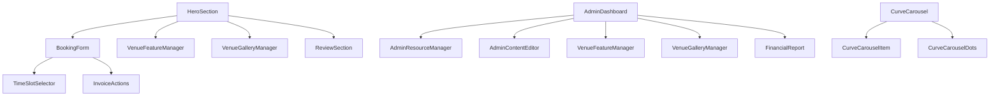

# Component Library Inventory

> Comprehensive catalog of all React components in the Klaten Minisoccer codebase

---

## 📁 Component Structure

```
components/
├── admin-dashboard.tsx           # Admin dashboard with stats & permissions
├── admin-resource-manager.tsx    # Generic CRUD table for admin resources
├── admin-content-editor.tsx      # Hero/content editor with image preview
├── animated-card.tsx             # Animated card with hover effects
├── booking-form.tsx              # Main booking form with time slots
├── curve-carousel.tsx            # 3D coverflow carousel for gallery
├── curve-carousel-dots.tsx       # Carousel navigation dots
├── curve-carousel-item.tsx       # Individual carousel card
├── financial-report.tsx          # Financial charts & reports
├── hero-section.tsx              # Homepage hero with background
├── invoice-actions.tsx           # Invoice download/print buttons
├── location-map.tsx              # Google Maps embed
├── review-section.tsx            # Customer reviews display
├── section-heading.tsx           # Consistent section headers
├── site-footer.tsx               # Site footer with links
├── site-header.tsx               # Navigation header with auth
├── theme-toggle.tsx              # Dark/light mode toggle
├── venue-feature-manager.tsx     # Admin CRUD for venue features
├── venue-gallery-manager.tsx     # Admin CRUD for gallery images
│
├── gallery/
│   ├── CurveCarousel.tsx
│   ├── CurveCarouselDots.tsx
│   └── CurveCarouselItem.tsx
│
└── ui/ (implicit)
    ├── Buttons (btn-primary, btn-secondary, etc.)
    ├── Inputs (input, textarea, select)
    ├── Cards (glass-panel, card-surface)
    └── Badges (status pills, tags)
```

---

## 🎯 Component Categories

### 1. Layout & Navigation

| Component | Path | Type | Description |
|-----------|------|------|-------------|
| `SiteHeader` | `components/site-header.tsx` | Client | Top navigation with logo, nav links, auth buttons |
| `SiteFooter` | `components/site-footer.tsx` | Server | Footer with contact, links, disclaimer |
| `SectionHeading` | `components/section-heading.tsx` | Server | Consistent section title + subtitle |

### 2. Homepage Sections

| Component | Path | Type | Description |
|-----------|------|------|-------------|
| `HeroSection` | `components/hero-section.tsx` | Client | Full-bleed hero with background, CTA, stats |
| `VenueFeatureManager` | `components/venue-feature-manager.tsx` | Client | Feature cards grid (admin + public) |
| `VenueGalleryManager` | `components/venue-gallery-manager.tsx` | Client | Gallery carousel (admin + public) |
| `ReviewSection` | `components/review-section.tsx` | Server | Customer reviews with form |
| `LocationMap` | `components/location-map.tsx` | Client | Google Maps embed with directions |

### 3. Booking Flow

| Component | Path | Type | Description |
|-----------|------|------|-------------|
| `BookingForm` | `components/booking-form.tsx` | Client | Date picker, time slots, customer info |
| `TimeSlotSelector` | (inline in booking-form) | Client | Time slot chips with states |
| `InvoiceActions` | `components/invoice-actions.tsx` | Client | Download/print invoice buttons |

### 4. Admin Dashboard

| Component | Path | Type | Description |
|-----------|------|------|-------------|
| `AdminDashboard` | `components/admin-dashboard.tsx` | Server | Stats cards, permissions, quick links |
| `AdminResourceManager` | `components/admin-resource-manager.tsx` | Client | Generic CRUD table (users, invoices, reviews, etc.) |
| `AdminContentEditor` | `components/admin-content-editor.tsx` | Client | Hero text/image editor with preview |
| `VenueFeatureManager` | `components/venue-feature-manager.tsx` | Client | Feature CRUD + drag-drop reorder |
| `VenueGalleryManager` | `components/venue-gallery-manager.tsx` | Client | Gallery CRUD + drag-drop reorder |
| `FinancialReport` | `components/financial-report.tsx` | Server | Revenue charts, peak hours, customer stats |

### 3D Carousel Gallery

| Component | Path | Type | Description |
|-----------|------|------|-------------|
| `CurveCarousel` | `components/gallery/CurveCarousel.tsx` | Client | 3D coverflow container |
| `CurveCarouselItem` | `components/gallery/CurveCarouselItem.tsx` | Client | Individual 3D card |
| `CurveCarouselDots` | `components/gallery/CurveCarouselDots.tsx` | Client | Navigation dots |

### 5. UI Primitives (via Tailwind)

| Category | Classes | Usage |
|----------|---------|-------|
| **Buttons** | `btn-primary`, `btn-secondary`, `btn-ghost` | CTAs, secondary actions |
| **Inputs** | `input`, `textarea`, `select` | Forms |
| **Cards** | `glass-panel`, `card-surface` | Content containers |
| **Badges** | `status-*`, `pill` | Status indicators |
| **Typography** | `text-display`, `text-h1`, `text-body` | Consistent text styles |

---

## 🔧 Component Usage Patterns

### Server vs Client Components

```tsx
// Server Component (default) - no 'use client'
export default function HeroSection() {
  return <section>...</section>;
}

// Client Component - interactive
'use client';

export function BookingForm() {
  const [date, setDate] = useState();
  return <form>...</form>;
}
```

### Props Interface Pattern

```tsx
interface BookingFormProps {
  initialDate?: string;
  onSubmit: (data: BookingData) => void;
}

export function BookingForm({ initialDate, onSubmit }: BookingFormProps) {
  // ...
}
```

### Styling with Design Tokens

```tsx
// Use CSS variables from DESIGN.md
<div className="bg-[var(--surface-bone-canvas)] text-[var(--color-navy-ink)]">
  <h1 className="font-[Archivo] text-[var(--text-display)]">Title</h1>
  <button className="bg-[var(--color-neon-action)] text-[var(--color-navy-ink)]">
    Book Now
  </button>
</div>
```

---

## 📦 Component Dependencies



---

## 📝 Adding New Components

### Checklist

- [ ] Create component file in `components/` or subfolder
- [ ] Add TypeScript props interface
- [ ] Use design tokens from `app/globals.css`
- [ ] Follow Server/Client component rules
- [ ] Add to this inventory
- [ ] Add Storybook story (when available)
- [ ] Write unit test in `tests/unit/components/`

### Naming Convention

| Type | Convention | Example |
|------|------------|---------|
| File | kebab-case | `booking-form.tsx` |
| Component | PascalCase | `BookingForm` |
| Props Interface | PascalCase + Props | `BookingFormProps` |
| Hook | camelCase + use | `useBookingForm` |

---

## 🔍 Component Search Index

| Feature | Components |
|---------|------------|
| **Booking** | `BookingForm`, `TimeSlotSelector`, `InvoiceActions` |
| **Admin CRUD** | `AdminResourceManager`, `VenueFeatureManager`, `VenueGalleryManager` |
| **Gallery** | `CurveCarousel`, `CurveCarouselItem`, `CurveCarouselDots` |
| **Auth** | `SiteHeader` (login buttons), `ThemeToggle` |
| **Content** | `AdminContentEditor`, `ReviewSection`, `LocationMap` |
| **Reports** | `FinancialReport`, `AdminDashboard` |

---

## 📚 Related Documentation

- [Design System](../02-architecture/design-system.md) — Tokens, colors, spacing
- [Routing](../04-frontend/routing.md) — App Router structure
- [Styling Guide](../04-frontend/styling-guide.md) — Tailwind v4 patterns
- [API Reference](../03-api-reference/admin-api.md) — Backend endpoints